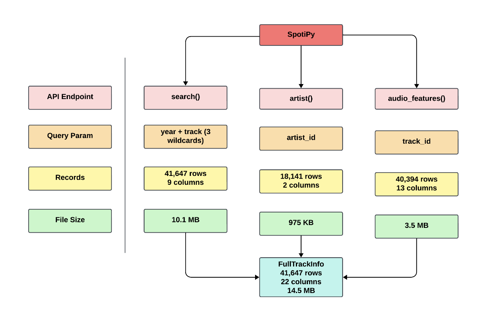

# SpotiPy Data Extraction

This project's code repository is designed to collect data on music tracks, their artists, and audio features using Spotify's Web API for the years 2010 to 2024. The aim is to build a broad dataset for analyzing music trends and supporting various research efforts.

## Data Collection Methods

We use the SpotiPy library, a Python client for Spotify's Web API, to help with data extraction.

### API Endpoints:
- **search()**: Retrieves track data by year and track name, using three random wildcard parameters for each year to expand our search threefold.
- **artists()**: Retrieves genre information crucial for categorizing music. As Spotify provides genre data at the artist level, this step adds genre details to our dataset by utilizing `artist_id` from the tracks' data.
- **audio_features()**: Retrieves in-depth audio characteristics of tracks, like tempo and energy, by using `id` from the tracks' data.

## Dataset Structure

The data is organized into:
- `SongsData.csv`: Contains track details (41,647 rows, 9 columns).
- `GenresData.csv`: Includes artist genres (18,141 rows, 2 columns).
- `AudioFeaturesData.csv`: Lists track audio features (40,394 rows, 13 columns).
- `FullTrackInfo.csv`: A combined dataset for in-depth analysis (41,647 rows, 22 columns).

For insights into how these datasets link together, see the data structure diagram included below:

## Spotify API Credentials Setup

Setting up Spotify API credentials is essential for using this code. Steps to acquire your Client ID and Client Secret are:
1. Register an application in the Spotify Developer Dashboard.
2. Input your `CLIENT_ID` and `CLIENT_SECRET` in the code's placeholders.
Check the [Spotify Developer Docs](https://developer.spotify.com/documentation/web-api/tutorials/getting-started) for a more detailed guide on how to do this.

## Appendix A: Wildcard Search Parameters

The table below lists the wildcard characters used yearly to enhance our search queries, thus broadening our data collection scope.

| Year | Wildcard Parameters  |
|------|----------------------|
| 2010 | v*, w*, i*           |
| 2011 | f*, w*, a*           |
| 2012 | e*, n*, b*           |
| 2013 | l*, q*, m*           |
| 2014 | z*, s*, u*           |
| 2015 | l*, f*, n*           |
| 2016 | c*, h*, e*           |
| 2017 | r*, u*, e*           |
| 2018 | p*, h*, k*           |
| 2019 | o*, q*, k*           |
| 2020 | p*, i*, t*           |
| 2021 | q*, u*, n*           |
| 2022 | x*, m*, k*           |
| 2023 | j*, n*, t*           |
| 2024 | s*, x*, g*           |
